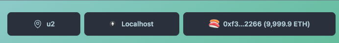

# Instate - Localized Web3

Instate is an experimental protocol created to build localized applications with local accounts. As well as a factory to create customizable network states.

## Connect Button

@instate/kit ConnectButton exports Rainbowkit's original ConnectButton with an additional LocalAccountButton that let user's pick the local account they would like to use for your application. Just like for networks, you can require a certain location and
propose a local account switch to your user, or (soon) a move if the user doesn't have a local account in your application vicinity.



```tsx

import { ConnectButton } from "@instate/kit"

const YourApp = () => {
  return <ConnectButton>
}

```

Deployments:

|Contract|Network|Proxy|Implementation|
|----|----|----|----|
|Map|Goerli|0x39Bd51dF4995C9eC14a16c15e4D832B3dd42D339|0x6D87C1647f228Baf8DE0374FCd7FdEBF6900fdFF|
|----|----|----|

More about it here: [Notion](https://savory-jumbo-54b.notion.site/Instate-Protocol-Localized-web3-d0653d226bf44831b8d07200d31d8f54?pvs=4)